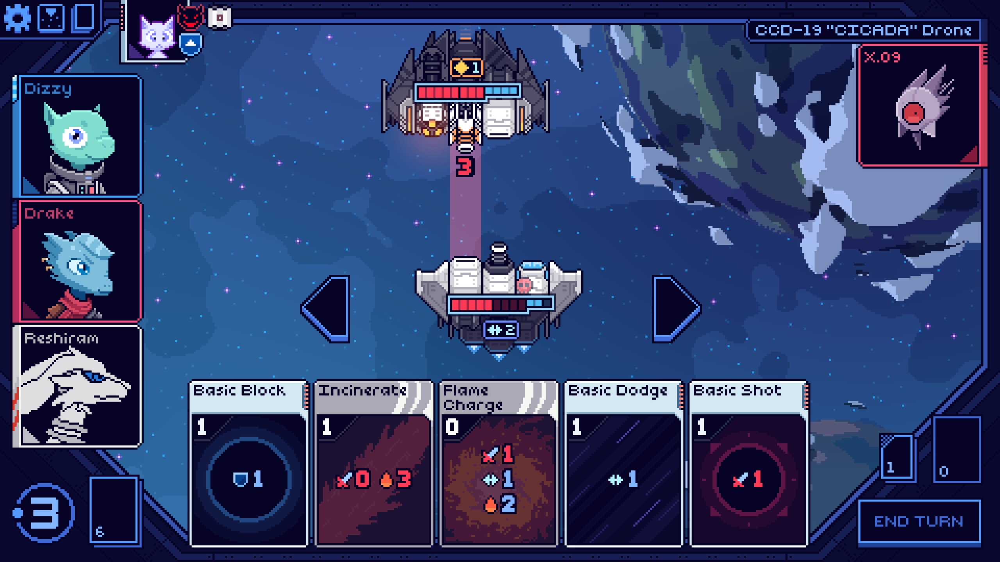
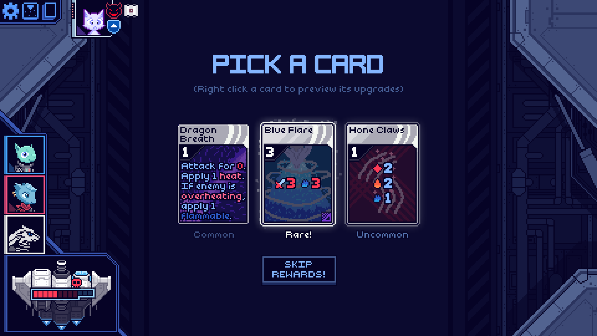

<!--
This README was made using Louis3797's awesome-readme-template
-->

  <h1>Reshiram Mod</h1>
  
  

    A legendary dragon that represents truth. Its cards utilize alongside other debuffs to set enemy ships ablaze.
  

<!-- Features -->
# Summary

This mod has added:

- <b>1/1</b> Characters
- <b>16/24</b> Cards
  - <b>8/9</b> common
  - <b>4/8</b> uncommon
  - <b>4/5</b> rare
  - <b>0/2</b> other (potentially 2 more planned...)
- <b>3/7</b> Artifacts
  - <b>2/5</b> common
  - <b>1/2</b> boss
- <b>2/3</b> Statuses

<!-- Screenshots -->
### :camera: Screenshots

 
  
  

