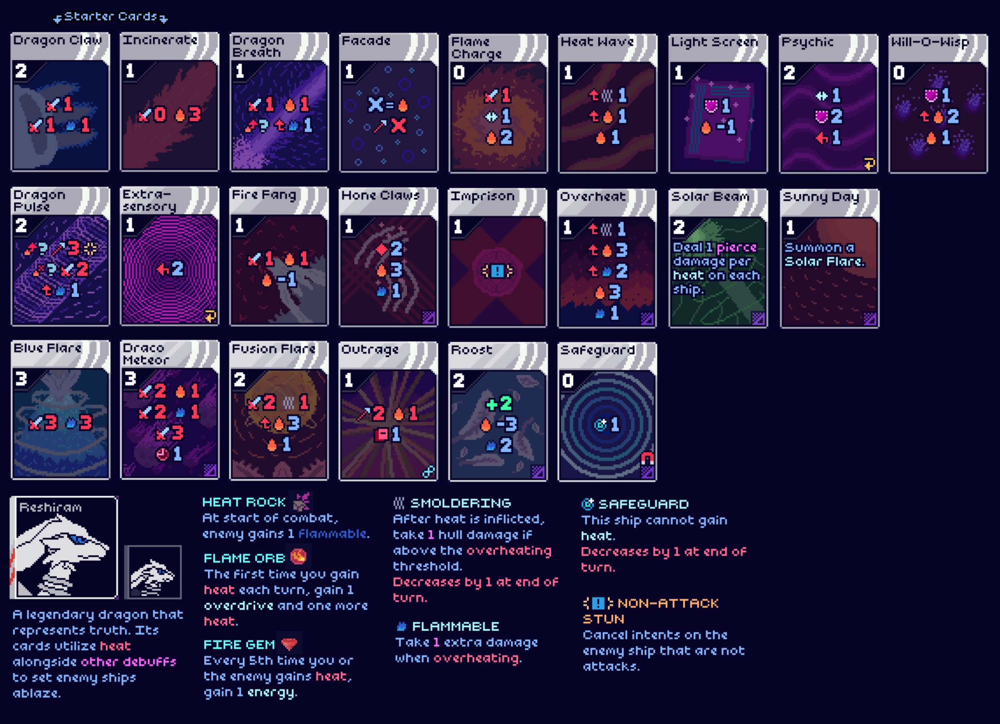
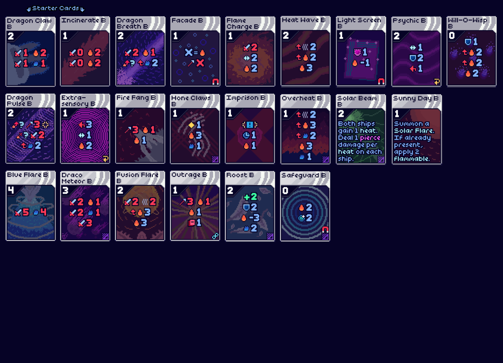

<!--
This README was made using Louis3797's awesome-readme-template
-->

  <h1>Reshiram Mod</h1>
  
  

    A legendary dragon that represents truth. Its cards utilize alongside other debuffs to set enemy ships ablaze.
  

<!-- Features -->
# Summary

This mod adds the following:

- <b>1</b> Character
- <b>29</b> Cards
  - <b>10</b> common
  - <b>8</b> uncommon
  - <b>6</b> rare
  - <b>5</b> other
- <b>7</b> Artifacts
  - <b>5</b> common
  - <b>2</b> boss
- <b>6</b> Statuses

# Content Infographics

<!-- Screenshots -->
# Screenshots

